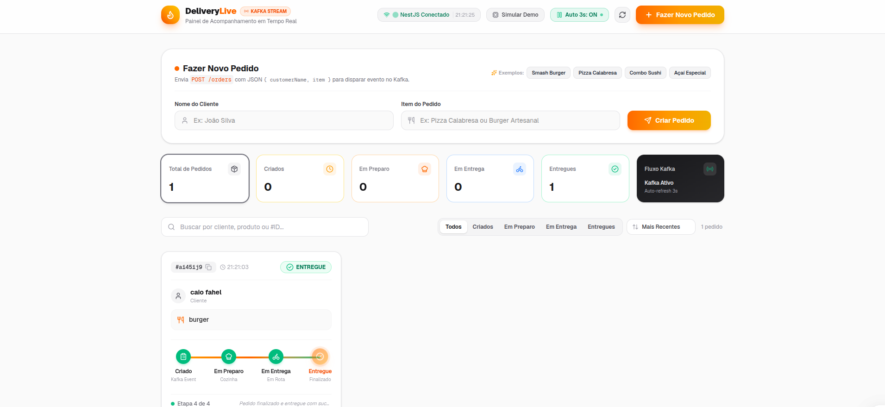
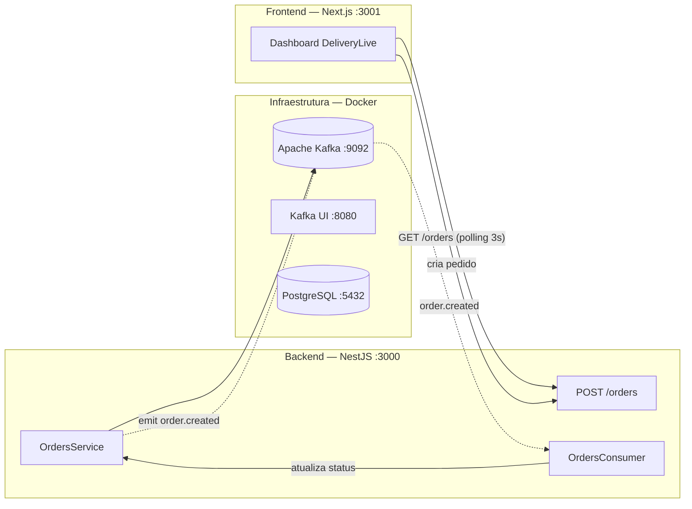

<div align="center">

# 🚚 DeliveryLive — Pedidos em Tempo Real com Apache Kafka

**Projeto de aprendizado** construído com **NestJS + Apache Kafka + Next.js** simulando um
sistema de delivery onde cada pedido flui por eventos em tempo real: criado → em preparo → em entrega → entregue.




</div>

---

## 🧠 Sobre o projeto

O **DeliveryLive** é um painel de delivery onde a pessoa registra um pedido e acompanha, em
tempo real, a evolução do status. Todo o fluxo é orientado a **eventos**:

- O **backend NestJS** publica o evento `order.created` no **Apache Kafka**.
- Um **consumer** do mesmo serviço consome o evento e simula a progressão do pedido
  (EM_PREPARO → EM_ENTREGA → ENTREGUE) ao longo do tempo.
- O **frontend Next.js** faz *polling* a cada 3 segundos e atualiza o dashboard ao vivo.

É um projeto **didático**: o foco está em demonstrar, na prática, como usar Apache Kafka com
NestJS (eventos, tópicos, producers e consumers) e como conectar a isso uma interface moderna em Next.js.

---

## 🏗️ Arquitetura



### Fluxo de eventos

1. O usuário registra um pedido no dashboard (ou chama `POST /orders`).
2. O `OrdersService` cria o pedido com status `CRIADO` e **emite** o evento `order.created` para o Kafka.
3. O `OrdersConsumer` recebe o evento e, via `setTimeout`, avança o status do pedido
   (5s → `EM_PREPARO`, 10s → `EM_ENTREGA`, 15s → `ENTREGUE`).
4. O frontend consulta `GET /orders` a cada **3 segundos** e reflete as mudanças na tela.

---

## 🧱 Stack

| Camada      | Tecnologias                                                            |
|-------------|------------------------------------------------------------------------|
| Backend     | NestJS 12, @nestjs/microservices, KafkaJS, TypeScript, OxLint, Vitest  |
| Frontend    | Next.js 16 (App Router), React 19, Tailwind CSS 4, lucide-react        |
| Mensageria  | Apache Kafka 7.5 (modo KRaft), Kafka UI                                |
| Infra       | Docker, Docker Compose, PostgreSQL 15                                   |

---

## 📁 Estrutura do projeto

```
├── delivery-backend/          # API NestJS (REST + Kafka producer/consumer)
│   └── src/
│   │   ├── main.ts            # Bootstrap + conexão microserviço Kafka
│   │   ├── app.module.ts
│   │   └── orders/
│   │       ├── orders.module.ts
│   │       ├── orders.controller.ts   # GET/POST /orders
│   │       ├── orders.service.ts      # Lógica + emit order.created
│   │       └── orders.consumer.ts     # Consome e simula status
│   └── Dockerfile
│
├── frontend/                  # Dashboard Next.js (App Router)
│   ├── app/                   # pages, layout e estilos
│   ├── components/            # Navbar, OrderCard, OrderStats, form, etc.
│   ├── services/api.ts        # Cliente HTTP para o backend
│   ├── types/order.ts         # Tipos e configuração visual dos status
│   ├── .env.example
│   └── Dockerfile
│
├── preview/                   # Prints de preview do projeto
├── docker-compose.yml         # Postgres + Kafka + Kafka UI + backend + frontend
└── README.md
```

---

## 🚀 Como executar

### Pré-requisitos

- [Docker](https://www.docker.com/) + [Docker Compose](https://docs.docker.com/compose/)
- [Node.js](https://nodejs.org/) 20+ (apenas para execução manual)
- Apache Kafka configurado **somente para uso local de desenvolvimento**

### Opção 1 — Tudo com Docker (recomendado)

```bash
docker compose up --build
```

`docker-compose.yml` sobe **toda** a infraestrutura automaticamente: PostgreSQL, Kafka (KRaft),
Kafka UI, backend NestJS e o frontend Next.js.

### Opção 2 — Componentes individuais (dev manual)

Suba apenas o Kafka e o Kafka UI:

```bash
docker compose up -d kafka kafka-ui
```

Depois rode backend e frontend separadamente:

```bash
# Backend (porta 3000)
cd delivery-backend
npm install
npm run start:dev

# Frontend (porta 3001)
cd frontend
npm install
cp .env.example .env.local
npm run dev
```

### Acesso aos serviços

| Serviço      | URL                         |
|--------------|-----------------------------|
| Frontend     | http://localhost:3001       |
| API Backend  | http://localhost:3000       |
| Kafka UI     | http://localhost:8080       |
| Kafka broker | localhost:9092              |
| PostgreSQL   | localhost:5432              |

---

## 🔌 Endpoints da API

| Método | Rota        | Descrição                                              |
|--------|-------------|--------------------------------------------------------|
| `POST` | `/orders`   | Cria um pedido `{ customerName, item }` e emite o evento `order.created` para o Kafka |
| `GET`  | `/orders`   | Retorna a lista de pedidos com o status atual          |

**Exemplo de criação de pedido:**

```bash
curl -X POST http://localhost:3000/orders \
  -H "Content-Type: application/json" \
  -d '{"customerName":"Maria Silva","item":"Pizza Margherita"}'
```

---

## 🎛️ Modo demo

O frontend possui um **modo demo**: se o backend NestJS estiver offline, basta ativar o
botão **"Ativar Modo Demo"** no topo do painel. Ele simula pedidos e a progressão de status
visualmente, permitindo validar a interface sem depender da infraestrutura.

---

## 🛡️ Segurança e observações

- Esse é um projeto **educacional**, com configurações de desenvolvimento **não adequadas para produção**.
- Credenciais do PostgreSQL (`admin` / `secretpassword`) e o `CLUSTER_ID` do Kafka são valores
  **fixos apenas para o ambiente local**; em cenários reais use variáveis de ambiente / secrets.
- Arquivos `.env*` são ignorados pelo `.gitignore` (exceto `.env.example`, sem segredos).
- Para validar os eventos em tempo real, abra o **Kafka UI** (http://localhost:8080) e inspecione
  o tópico `order.created` enquanto cria pedidos no dashboard.

---

## 📄 Licença

Distribuído para fins de **aprendizado**. Sinta-se à vontade para usar, estudar e modificar. 😉